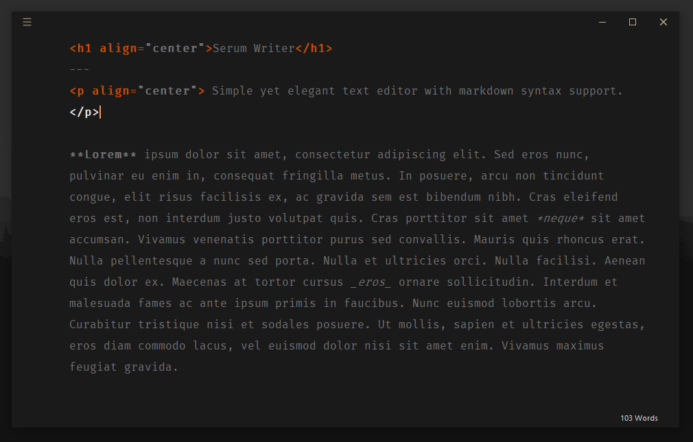
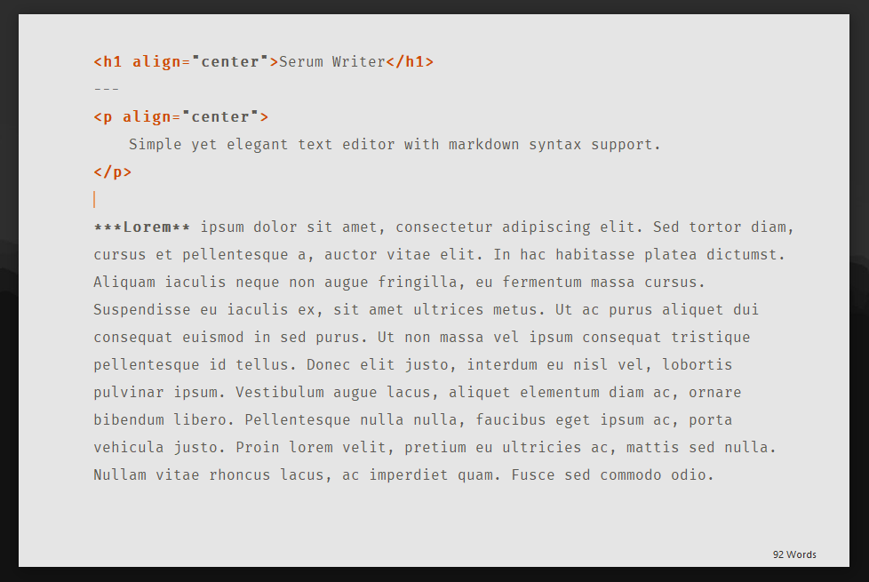
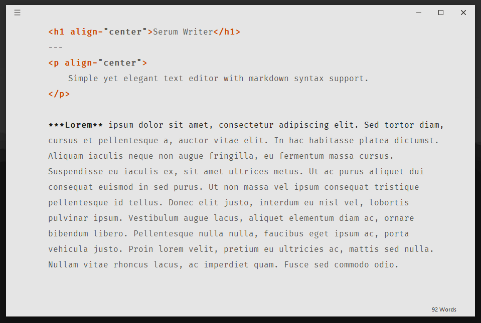

<p align="center">
  <a href="https://github.com/serumstudio/writer">
    
    <h3 align="center">Serum Writer</h3>
  </a>
</p>

<blockquote align="center">
  Next generation - elegant text editor with modern markdown syntax.
</blockquote>

<p align="center">
  <a href="https://github.com/serumstudio/writer#serum-writer-1"><strong>Information</strong></a> ·
  <a href="https://github.com/serumstudio/writer#-installation"><strong>Installation</strong></a> ·
  <a href="https://github.com/serumstudio/writer#-features"><strong>Features</strong></a> ·
  <a href="https://github.com/serumstudio/writer#-contributors"><strong>Contributors</strong></a>
</p>
<br/>

## 📃 Serum Writer
Writer a free open-source modern text editor built for those who love to type with the support of *markdown syntax*. <br>
This editor has a elegant and pleasant theme. The editor was created to make typing easier and better. As a developer <br>
and a student, reading and writing became one of my hobbies. We built Serum Writer for productivity. 

## ⚡ Installation
You can install the source using PIP. However if you want to install the built executable files, please navigate to 
[Releases](https://github.com/serumstudio/writer/releases). <br>The current version is v`0.0.1`. 

If you want to install with the source, You will need to use [Python 3.8+](https://python.org/downloads).
```bash
$ pip install serumwriter
```

## ✨ Features
In Serum Writer, there are built-in feature that you can use. But you can create your own **plugin** *(experimental)* to make it better.

Here are some avaialable features.

- WYSIWYG Editor. It is a simple and distraction free editor powered by Qt Technologies `(PyQt5 - QTextEdit)`
- Live Preview `(Ctrl + R)`. Writer has a built in live preview that shows the output realtime.
- Markdown syntax. As I mentioned earlier, the editor supports several type of syntax including <br> **markdown**, **html**, **reconstructedText**, and **textile**.
- Multi-themed editor. Serum Writer supports 2 main themes. The Dark theme and Light theme. <br> You can also [create your own theme](https://github.com/serumstudio/writer)

<p align="center"> themes and configuration 🌙 </p>
<table align="center">
  <tr>
      <td align="center" colspan="4">
        <b>Dark</b>  
      </td>
  </tr>

  <tr>
    <th>
      
    </th>
    <th>
      
    </th>
  </tr>
  
  <tr>
      <td align="center" colspan="4">
        <b>Light</b>  
      </td>
  </tr>
  
  <tr>
    <td>
      
    </td>
    <td>
      
    </td>
  </tr>
</table>

## 💻 Contributors
Serum Writer would be nothing without these contributors.

<a href="https://github.com/serumstudio/writer/graphs/contributors">
  
</a>

